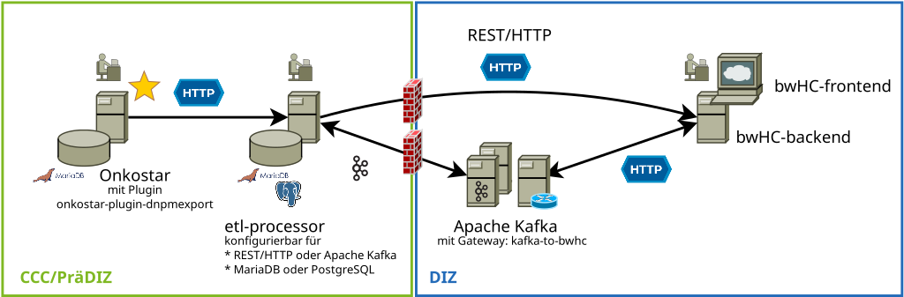

# Onkostar Plugin "onkostar-plugin-dnpmexport"

Aufgabe dieses Plugins ist es, die Inhalte der DNPM-Formulare in die Datenstruktur des bwHC-Datenmodells zu wandeln und
anhand festgelegter Regeln die Notwendigkeit zum Export zu prüfen und diesen durchzuführen.

Hierzu verwendet das Plugin die Library `bwhc-dto-java`, eine Rückportierung der bwhC-DTOs für die Programmiersprache Java.

## Einstellungen

Zum Betrieb dieses Plugins ist die Angabe der URL der Zielanwendung erforderlich.

Dies lässt sich initial durch folgende Datenbankanfrage anlegen, später dann in den allgemeinen Einstellungen von Onkostar auch ändern.

```
INSERT INTO einstellung
  (name, wert, kategorie, beschreibung) 
  VALUES(
    'dnpmexport_url',
    'http://localhost:9000/bwhc/etl/api/MTBFile',
    'DNPM',
    'DNPM-Export - URL'
  );

INSERT INTO einstellung
  (name, wert, kategorie, beschreibung)
  VALUES(
    'dnpmexport_prefix',
    'TEST',
    'DNPM',
    'DNPM-Export - Prefix'
  );

INSERT INTO einstellung
  (name, wert, kategorie, optionen, beschreibung) 
  VALUES(
    'dnpmexport_export_consent_rejected',
    'false',
    'DNPM',
    '[{"key": "true", "value": "Ja"},{"key": "false", "value": "Nein"}]',
    'Exportiere MTB-Daten ohne Consent-Zustimmung'
  );
```

_**Achtung!**_ Die Verwendung der Konfigurationskategorie `DNPM` ist für Onkostar-Versionen **>=2.12.0** und **<2.13.0**
aufgrund einer Umstellung in der Darstellung der Konfiguration in Onkostar nicht möglich.
Für Onkostar ab Version **2.13.0** (oder neuer) kann `DNPM` verwendet werden, für Versionen beginnend mit 2.12 sollte
`System` verwendet werden.

Ein Export von Daten ohne Consent-Zustimmung ist durch die Einstellung *Exportiere MTB-Daten ohne Consent-Zustimmung* möglich.
Eine entsprechende Behandlung der Daten findet im ETL-Processor statt.

Das Plugin ist durch entsprechende Konfiguration der Export-URL auch in der Lage, Daten - im MTBFile-JSON-Format - an das bwHC-Backend zu senden.
**Hiervon wird jedoch abgeraten, da ohne eine weitere Behandlung der Informationen die Patienten-ID im Klartext übertragen wird**

## Einordnung innerhalb einer DNPM-ETL-Strecke

Dieses Plugin erlaubt das Extrahieren (das "E" in ETL) der benötigten Informationen aus Onkostar und das Übertragen an die weitere ETL-Strecke.

Zudem werden bereits hier die später nicht mehr im Klartext benötigten Prozedur-IDs anonymisiert und bei fehlendem Consent oder Consent-Widerruf
ein Löschen der Informationen initiiert.



## Ablauf des Exports

Beim Abschließen eines DNPM-Formulars wird für die Formulare (und damit auch Unterformulare)

* DNPM Klinik/Anamnese
* DNPM Therapieplan
* DNPM FollowUp *(aktuell nich nicht umgesetzt)*

der Inhalt aller zugehörigen DNPM-Formulare für den Patienten und die Erkrankung, für den/die ein DNPM-Formular abgeschlossen wurde, ermittelt und zusammengetragen.

Hierbei wird im Falle eines Formulars *DNPM Therapieplan* oder *DNPM FollowUp* das entsprechende Formular *DNPM Klinik/Anamnese*
ermittelt und in Folge die zugehörigen Formulare ermittelt:

* **DNPM Klinik/Anamnese** => Ermittlung der Formulare *DNPM Therapieplan* die einen Formularverweis auf dieses Formular eingetragen haben.
* **DNPM Therapieplan** => Ermittlung der Formulare *DNPM FollowUp* die einen Formularverweis auf dieses Formular eingetragen haben.
  Zudem werden die Formulare *OS.Tumorkonferenz* und *OS.Molekulargenetik* anhand der verwendeten Verweise ermittelt.
* **DNPM FollowUp** => Dieses Formualr enthält keine weiteren relevanten Verweise, da der Verweis auf *DNPM Therapieplan* bereits berücksichtigt wurde.

Es folgt direkt im Anschluss die Anonymisierung der Prozedur-IDs, da diese Information im späteren Verlauf nicht mehr im Klartext benötigt wird.

### Anonymisierung der Prozedur-IDs

Sämtliche **Prozedur-IDs** werden anonymisiert, indem aus der bekannten Prozedur-ID ein SHA256-Hash gebildet wird und dieser - zuzüglich Exportprefix - als
40 Zeichen lange, Base32-codierte Zeichenkette verwendet wird.

Somit ist das Erlangen einer direkten Kenntnis über die tatsächliche Prozedur-ID nicht mehr möglich.

Die **ID eines Patienten** wird nicht anonymisiert und kann in den direkt folgenden, nachgelagerten Schritten pseudonymisiert werden,
um über eine Treuhandstelle und den Einsatz einer Pseudonymisierungssoftware eine Möglichkeit zur Rückverfolgung zu gewährleisten.

### Übermittlung der Daten an nachgelagerte Schritte im ETL-Prozess

Es wird nach der Anonymisierung der Prozedur-IDs ein HTTP-Request ausgelöst, der die MTBFile-JSON-Daten an den
konfigurierten Endpunkt überträgt.

**Dies erfolgt ohne weiters Zutun von Seiten des Anwenders und wird bereits durch das Abschließen eines DNPM-Formulars ausgelöst.**
